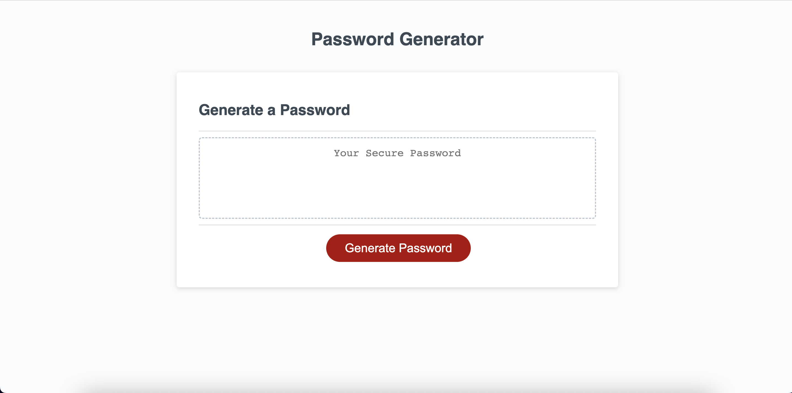

# Website to generate random password based on user inputs

## Description
This project has HTML, CSS and JS for a website that generates a random password based on user inputs. It takes following inputs from user -
1. Length of the password.
2. Which character types to be include in the password. Possible options are lowercase, uppercase, numeric and special characters.

This project uses Javascript's Array, For loop and Math library to generate the random password.

## Installation

N/A

## Usage

This website has a Generate Password button. When user clicks on the button, user is prompted to provide inputs. Based on these inputs, a random password is generated and shown in the Box above the button.

These are the inputs for which user is prompted - 
1. Enter the length of the password.  
This number should be between 8 and 128. Any other number or pressing on **"Cancel"** would terminate the program.

2. Do you want lowercase characters in your password?  
If user selects **"Ok"**, lowercase characters will be included in the generated password.

3. Do you want uppercase characters in your password?  
If user selects **"Ok"**, uppercase characters will be included in the generated password.

4. Do you want numeric characters in your password?  
If user selects **"Ok"**, numeric characters will be included in the generated password.

5. Do you want special characters in your password? 
If user selects **"Ok"**, special characters will be included in the generated password.

After user enters all these inputs, a random password is shown in the box on the website. Random password has characters from the selected character sets.

If user doesn't selects **"Ok"** for any of the character sets, program will terminate with a message.

**Screen shot of the website**  

Link of deployed application - 
https://mypooja.github.io/random-password-generator/

## Credits

None

## License

Please refer to the LICENSE in the repo.